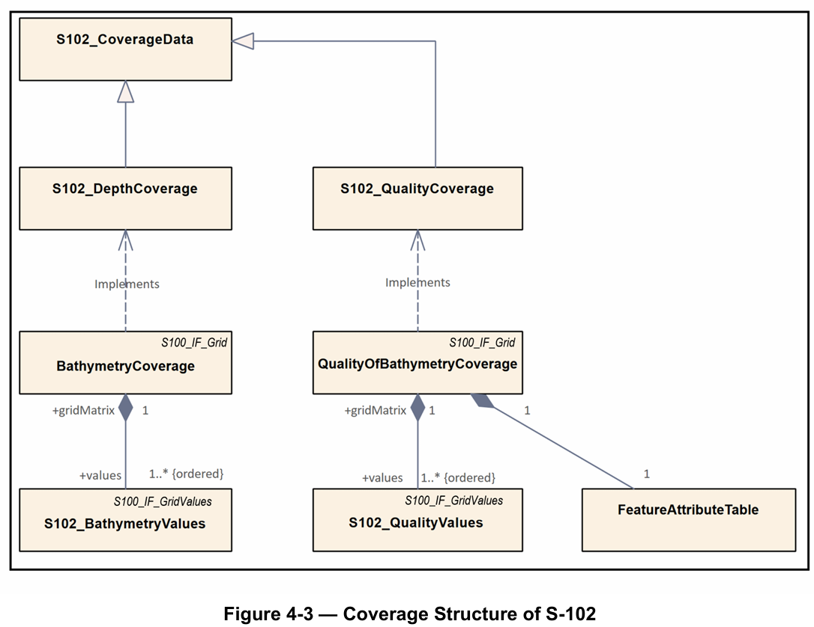

# [사업기획팀 내부 프로젝트] 표준 설명자료 제작을 위한 내용 정리

담당자: 장은채
상태: Done
관리자: 김현주
시작일: 2026/04/16
완료일: 2026/04/22
완료 예정일: 2026/04/22 12:00 (GMT+9)
작성자: 장은채
작성일자: 2026년 4월 13일 오후 1:58

## 🎯 Goal / Background

> 업무 목적 또는 배경을 작성합니다.
> 

<aside>

- 표준자료 내용 정리 (~ 4/28)
    - 기존에 정리했었던 PPT 및 다른 표준문서들 참고하면서 내용 정리
        - `RnD\4. 기타\회사 기술소개자료`
        - `Research\Standard`
    - 정리항목
        - 표준 개요
        - 적용목적 및 대상
        - 버전 업데이트 타임라인
        - 모델 구성
        - 심볼, 테스트데이터셋 예시
        - 활용 사례
</aside>

---

## ✅ Todo

> 수행 업무를 체크박스로 나열하고 완료 시 체크합니다.
> 
- [x]  S-102
- [x]  S-158
- [x]  S-158(98)
    - S-158, S-158(100), S-158(98)은 다음 자료를 참고하여 정리
        - `Projects\2025\05_2025년 차세대 수로정보 표준연구\07_실무\158 지침서`
            
            [차세대 수로제품 제작 및 활용 지침.pdf](%EC%B0%A8%EC%84%B8%EB%8C%80_%EC%88%98%EB%A1%9C%EC%A0%9C%ED%92%88_%EC%A0%9C%EC%9E%91_%EB%B0%8F_%ED%99%9C%EC%9A%A9_%EC%A7%80%EC%B9%A8.pdf)
            

---

## 📝 Result

> 업무 수행 과정, 결과, 산출물, 후속 작업 계획을 기록합니다.
> 

# S-102

**표준 개요**

- S-102는 S-100 기반의 수심 표면(Bathymetric Surface) 제품사양 표준이며, 해저면을 정규 격자(regular grid) 형태의 디지털 수심 표면으로 표현하는 제품을 정의합니다.
- 정식 명칭은 Bathymetric Surface Product Specification이며, Edition 3.0.0은 2024년 12월 발행되었습니다.
- digital elevation model로 설명되며, 단독으로 사용되거나 향후 S-100 기반 ECDIS 항해 지원의 핵심 요소로 활용될 수 있습니다.
- 수심 표면 제품에 필요한 콘텐츠 모델, 인코딩 구조, portrayal, exchange file format을 함께 규정하고 있으며, 수심값과 품질 · 출처 관련 정보를 함께 다루는 표준입니다.

**적용목적 및 대상**

- 목적
    - 고해상도 수심 정보를 격자 형태로 제공하여 안전항해를 지원하는 것을 목적으로 하고 있으며, 수심 정보를 표준화된 형식으로 제공함으로써 정밀 항해와 해양 응용 서비스에 활용 가능한 공통 기반을 마련합니다.
    - S-100 기반 항해 시스템에서 safe passage, precise berthing and mooring, route planning을 지원하는 수심 정보 제품으로 사용되도록 정의되어 습니다.
    - 더불어, 수심값뿐 아니라 선택적 uncertainty와 quality metadata를 함께 제공하여 데이터의 활용성과 신뢰성 판단도 함께 지원합니다.
- 대상
    - 해수면 아래 지형을 수심 격자 형태로 표현하는 bathymetric surface 데이터 제품을 대상으로 하고 있으며 적용 공간 범위는 바다, 하천, 호수 등 수역 전반이며, marine navigation에 필요한 영역을 포괄하고 있습니다.
    - 주요 활용 대상은 아래와 같습니다.
        - S-100 기반 ECDIS 및 항해 시스템
        - 위 시스템을 위한 수심 데이터 생산 · 배포 체계
        - 데이터 생산 관점에 : 수로기관 및 bathymetric grid 생산자
        - 활용 관점 : 항해 시스템 개발자와 최종 사용자 시스템

**버전 업데이트 타임라인**

- 2024.07 / Version 3.0.0
    - cell area-based approach를 반영하도록 본문과 도식 수정
    - 하나의 제품 내 multiple vertical datums 지원 추가
    - 기존 QualityOfSurvey를 QualityOfBathymetryCoverage로 변경
    - S-100 Edition 5.2.0 정렬 반영
    - 정확성 및 명확성 향상을 위한 전반적 문구·도식 수정
    - 여러 부속서(implementation guidance, portrayal catalogue, dataset size, multi-resolution gridding, gridding source bathymetry) 제거
- 2023.04 / Version 2.2.0
    - 공간 표현 방식을 regular grid(DCF 2) 에서 feature oriented regular grid(DCF 9) 로 변경
    - 개별 grid cell 품질·출처 메타데이터 제공을 위한 QualityOfSurvey feature 추가
    - exchange set structure, exchange catalogue, discovery metadata를 S-100 Part 17에 맞게 정렬
    - dataset structure 및 embedded metadata attributes를 S-100 Part 10c에 맞게 정렬
    - product-specific metadata classes/attributes 제거 및 embedded/distributed metadata 방식으로 대체
    - ISO metadata를 S-102 exchange set에 포함하는 규정 제거
- 2022.05 / Version 2.1.0
    - exchange catalogue 파일명을 CATALOG.XML로 수정
- 2021.03 / Version 2.1.0
    - S-102 v2.1 범위를 Navigation Only로 제한하는 방향 반영
    - minimum/maximum depth와 associated uncertainty의 저장 위치 수정
    - metadata를 별도 ISO 형식 파일로 저장하는 방향 합의
    - 내부 참조 정비
- 2020.11 / Version 2.1.0
    - 2.1 초안 작성
    - track changes 및 tiling 옵션 제거 방향 반영
    - 기존 sample HDF encoding dump 부속서 제거
- 2019.09~10 / Version 2.0.0
    - HSSC 및 S-102 PT 의견 반영
    - Annex A, B 및 Clause 4, 10, 12 수정
- 2019.01~02 / Version 2.0.0
    - 5차 S-102 PT 회의에서 HSSC 및 S-102 PT 의견 조정
    - Clause 1, 3, 4, 5, 6, 9, 10, 11, 12 및 Annex A, B, D, F, G, I 수정
- 2018.10~11 / Version 2.0.0
    - HSSC Letter 02/2018 redline comment 반영
    - Clause 1, 3, 4, 5, 6, 9, 10, 11, 12 및 Annex A, B, D, F, G, I 수정
- 2018.06 / Version 2.0.0
    - S-100 v4.0.0 및 S-100 Part 10c 개발 방향에 맞춰 정렬
    - 다수 조항 및 부속서 전반 수정
- 2018.02 / Version 2.0.0
    - Clause 9.0 수정
    - Part 10c guidance 반영 준비를 위해 Annex B 내용 삭제
    - Dataset Size and Production, Gridding Example, Multi-Resolution Gridding, future tiling 관련 부속서 추가
- 2017.05 / Version 2.0.0
    - S-100 WG2 피드백에 따라 Clause 9.0 수정
- 2017.03 / Version 2.0.0
    - Clause 4.0, 12.0 업데이트
    - Clause 9.0 및 Annex B 보강
- 2012.04 / Version 1.0.0
    - S-102 최초 승인판 발행

**모델 구성**

- S-102는 수심 정보를 격자형 coverage로 표현하는 구조를 사용합니다.
    
    
    
    *Figure 4-3 — Coverage Structure of S-102*
    
- 제품은 크게 BathymetryCoverage와 QualityOfBathymetryCoverage로 구성됩니다.
    - `BathymetryCoverage`
        - 각 grid cell에 대한 depth와 선택적 uncertainty 값을 담습니다.
    - `QualityOfBathymetryCoverage`
        - 각 grid cell이 참조할 수 있는 품질 · 출처 메타데이터 id를 제공합니다.
        - 실제 상세 품질 정보는 `featureAttributeTable`에 기록합니다.
- 데이터셋은 정규 격자(regular grid) 기반으로 구성됩니다.
    
    
    
    *Figure 4-2 — Data Set Structure of S-102*
    
    - 가장 남서쪽에 위치한 격자점(grid point)을 기준으로 위치 참조(georeferencing)가 이루어집니다.
    - 격자셀(grid cell)은 grid point를 중심으로 배치됩니다.
- 하나의 S-102 제품은 HDF5 계층 구조로 인코딩되며, Root Group 아래에 metadata, feature information, feature container, values dataset 등이 배치됩니다.
    
    
    
    *Figure 10-1 — Outline of the generic data file structure*
    
- 수심값(depth) 과 품질 정보(quality metadata) 가 분리되어 있으면서도 동일 격자 체계 안에서 함께 사용되도록 설계되어 있습니다.

**심볼, 테스트데이터셋 예시**

- 심볼
    
    
    
    *Figure 9-1 — S-52, Edition 6.1(.1) Depth Zone Colouring for Day*
    
    
    
    *Figure 9-2 — Sun-illuminated and Static (Flat) Shading*
    
    - Portrayal Catalogue를 통해 S-102 수심 표면의 시각화를 위한 portrayal 체계를 정의하고 있습니다.
    - 수심대 색상 표현과 음영 표현 방식을 사용합니다.
        - S-102 portrayal 목적
            - bathymetric surface의 명확하고 일관된 표시
            - mariner에게 익숙한 표현 유지
            - S-100 portrayal model 기반 상호운용성 확보
- 테스트데이터셋
    - 제품 구조 및 표출 예시
    
    
    
    *Figure 4-5 — S-102 grid structure. Grid origin is the lower left grid point. Grid cells are centered around grid points. Bounding box is coincident with the outermost grid cell boundaries.*
    
    
    
    *Figure 4-6 — S-102 Grid point location*
    
    *Table 10-1 — Overview of S-102 Data Product*
    
    | LEVEL 1 CONTENT  | LEVEL 2 CONTENT  | LEVEL 3 CONTENT  | LEVEL 4 CONTENT |
    | --- | --- | --- | --- |
    | General Metadata
    (metadata)
    (h5_attribute) |  |  |  |
    | Feature Codes
    Group_F
    (h5_group) | Feature Name
    BathymetryCoverage
    (h5_dataset) |  |  |
    |  | QualityOfBathymetryCoverage
    (h5_dataset) |  |  |
    |  | Feature Codes
    featureCode  |  |  |
    | Feature Type
    BathymetryCoverage
    (h5_group) | Type Metadata
    (metadata)
    (h5_attribute) |  |  |
    |  | Feature Instance
    BathymetryCoverage.01
    …
    BathymetryCoverage.nn
    (h5_group) | Instance
    Metadata
    (metadata)
    (h5_attribute) |  |
    |  |  | First data group
    Group_001
    (h5_group) | Group Metadata
    (metadata)
    (h5_attribute) |
    |  | X and Y Axis Names
    axisNames
    (h5_dataset) |  | Bathymetric Data Array
    values
    (h5_dataset) |
    | Feature Type
    QualityOfBathymetryCoverage
    (h5_group) | Metadata
    (h5_attribute)
    (same as BathymetryCoverage) |  |  |
    |  | QualityOfBathymetryCoverage.01
    (h5_group) | Group_001
    (h5_group) | Group Metadata
    (metadata)
    (h5_attribute) |
    |  | X and Y Axis Names
    axisNames
    (h5_dataset) |  | Quality of Bathymetry
    Data Array
    values
    (h5_dataset) |
    |  | Feature Attribute Table
    (h5_dataset) |  |  |
    
    
    
    *Figure 10-2 — Hierarchy of S-102 Data Product*
    
    *Table 10-3 — Sample contents of the BathymetryCoverage and QualityOfBathymetryCoverage arrays*
    
    | Name | Explanation | BathymetryCoverage |  | QualityOfBathymetryCoverage |
    | --- | --- | --- | --- | --- |
    |  |  | S-100
    Attribute 1 | S-100
    Attribute 2 | S-100 Attribute 1 |
    | code | Camel Case code of
    attribute as in Feature
    Catalogue | depth | uncertainty | ID |
    | name |  Long name as in Feature
    Catalogue | depth | uncertainty | ID |
    | uom.name | Units (uom.name from
    S-100 Feature Catalogue) | metres | metres | (empty) |
    | fillValue | Fill value (integer or float,
    string representation, for
    missing values) | 1000000 | 1000000 | 0 |
    | datatype | HDF5 datatype, as returned
    by H5Tget_class() function | H5T_FLOAT | H5T_FLOAT | H5T_INTEGER |
    | lower | Lower bound on value of
    attribute | -14 | 0 | 1 |
    | upper |  Upper bound on value of
    attribute | 11050 | (empty) | (empty) |
    | closure |  Open or Closed data
    interval. See S100_
    IntervalType in S-100, Part 1 | closedInterval | geSemiInterval | geSemiInterval |
    |  |  |  |  |  |

**활용 사례**

- OpenS100 : Open source S-100 Viewer Project
    
    
    
    OpenS100 시스템 구성
    
    
    
    OpenS100 이용 화면
    

# S-158

**표준 개요**

- S-158은 S-100 기반 데이터 제품의 검증 규칙 체계를 정의하는 프레임워크 표준입니다.
- 개별 데이터 제품을 직접 정의하는 문서가 아닌 검증 규칙 문서의 구조와 작성 기준을 제시하는 상위 규격입니다.
- 정식 명칭은 Validation Checks – Introduction and Structure이며, Edition 1.0.0은 2025년 2월 발행되었습니다.
- S-158 시리즈는 아래와 같이 구성되며, S-158 문서는 아래 문서의 공통 기반이 됩니다.
    - S-158 : 검증 규칙 프레임워크
    - S-158:100 : 공통(Generic) 검증 규칙
    - S-158:1xx : 제품별 검증 규칙
    - S-158:98 : 제품 간 상호운용성 검증 규칙
- 모든 S-158:1xx 문서는 S-158의 구조와 원칙을 따라야 하며 S-158은 데이터 자체보다 검증 규칙의 구조, 문법, 분류, 적용 순서를 표준화하는 데 초점을 두고 있습니다.

**적용목적 및 대상**

- 목적
    - S-100 기반 데이터셋과 교환셋의 정확성, 완전성, 무결성을 검증하기 위한 기준을 제공합니다.
    - 데이터 검증 시 제품 내부 오류, 제품 간 충돌, 패키지 구조 오류를 체계적으로 점검할 수 있도록 합니다.
    - 최종 사용자 시스템에서 사용 가능한 수준의 데이터 품질 확보를 지원합니다.
- 대상
    - S-100 기반 데이터셋(dataset) 검증
    - 교환셋(exchange set) 및 관련 metadata, signature 검증
    - S-128 기반 product catalogue dataset의 정합성 확인
- 주요 활용 대상
    - 데이터 생산자
    - 집성자
    - 배포자
    - 응용시스템 및 검증 소프트웨어 개발자

**버전 업데이트 타임라인**

- 2025.02 / Version 1.0.0
- S-158 첫 구현 및 시험(implementation and testing)용 Edition으로 발행
- 2025.02 / Version 1.0.0 Draft 1
    - references 및 specification metadata 업데이트
- 2024.11 / Version 0.2.0
    - 검토 의견 반영
    - S-100 WG9 결정사항 반영
    - check classification 관련 문구 수정
    - S-158:1xx 유지관리 체계 개정
- 2024.08 / Version 0.1.0
    - Initial draft 작성

**모델 구성**

- 검증 규칙은 공통적으로 아래의 항목으로 구성됩니다.
    - *Table 3-1 - Structure of checks*
    
    | Column Name (Tag) | Table 3-1 - Structure of checks |
    | --- | --- |
    | Dev ID
    (Dev_ID)  | Temporary number for checks under development. This column may be
    included for tracking of checks under development but should be deleted
    from finalized documents, when no longer required. May be structured as
    decided by the development team for the specification. Must consist only of
    alphanumeric characters in the ISO basic Latin alphabet, hyphen and
    underscore characters (A-Z, a-z, 0-9, - and _ characters).
    EXAMPLES: S101_Dev_0029, P1-4, 1, 100_Dev0001  |
    | Check ID
    (Check_ID)  | Identifier for check. Must be structured as 1XX_nnnn where “1XX” is the
    Product Specification number and “nnnn” a four digit number assigned by
    the development team for the specification. An optional single-letter lower
    case alpha suffix in the range a-z may be added when a check is split into
    two or more checks. Check identifiers are unique and are not reused after
    a check is deleted, but may be re-introduced if the original check is revived
    either with or without modification
    EXAMPLES: 101_1005, 102_2012, 102_2012a |
    | Classification
    (Classification)  | Whether check failure is a critical, error, or warning issue. See clause 7
     |
    | Check message
    (Check_Message) | Message to emit if the dataset or exchange set fails the check. This must
    be a message that provides the user with meaningful information.  |
    | Check description
    (Check_Description)  | Check description written in a defined syntax (wherever feasible) as defined
    in this document (see clause 4).  |
    | Check solution
    (Check_Solution)  | Suggested action to rectify a warning or error  |
    | Standards document
    reference
    (Document)  | Reference to the S-100 standard or a Product Specification.
    Must include the Part, Annex or component, if any.
    EXAMPLES: S-100 Part 10a; S-101 PS; S-101 Annex A; S-129 DCEG  |
    | Clause reference
    (Reference) | The clause number in the cited document. If derived from a numbered table,
    the table number may be cited instead (with the “Table” prefix).
    Examples: 15.9.1; Table 10.2  |
    | Data quality measure
    (DQMeasure)
    Optional | Quality measure from the Data Quality clause of the PS or S-97 Part C if
    not identified in the PS. This column is optional.
    EXAMPLES: “Thematic accuracy”; “Logical consistency/Format
    consistency”  |
    | Introduced
    (Introduced) | The earliest edition of the cited standard or PS from which the check is
    derived. |
    | Modified
    (Modified)  | The latest edition of the cited standard or PS in which the requirement or
    recommendation on which the check is based was modified.
    Empty if no modifications. |
    | Deleted
    (Deleted) | The earliest edition of the cited standard or PS in which the requirement or
    recommendation on which the check is based was removed or modified so
    as to no longer require the check.
    Empty if the check is still applicable. |
- 각 검증 항목은 표 형식의 columnar structure로 정의됩니다.
- 필요 시, 아래와 같은 이력성 항목을 추가할 수 있습니다.
    - Data quality measure
    - Introduced
    - Modified
    - Deleted
- 검증 문법은 generic S-100 checks, product-specific checks로 구분되며, 비교·논리 연산자와 공간 연산자를 활용해 조건식을 기술합니다.
- 검증 활동은 아래와 같이 구분됩니다.
    - 단일 데이터셋 내부 검사
    - 동일 제품 내 데이터셋 간 검사
    - 제품 간 상호운용성 검사
    - 패키지 검사
    - *Figure 5-1 - Outline of Validation*
        
        
        
    - *Table 5-1 - Validation activities*
        
        
        | Validation
        Activity  | Thing
        Validated  | Controlling Specification
        or Artifact  | Validator(s)  | Examples |
        | --- | --- | --- | --- | --- |
        | a | Dataset in
        isolation  | S-1xx PS
        S-100 generic
        structuring in
        Parts 10a, 10b,
        10c (e.g., 10a-47)  | dataset
        producer  | Non-conformant file names,
        incorrect ordering of features  |
        | b | Dataset in
        isolation  | S-100 Part 7
        S-100 Part 10c  | dataset
        producer  | Things which contravene the
        geometry model, e.g., CCW
        exterior rings, unused curves |
        | c | Dataset in
        isolation  | S-100 Data
        Format (Parts
        10a, 10b, 10c)  | dataset
        producer | Formatting problems with
        encodings, non-conformant
        GML, incorrect HDF5 group
        names, incorrectly formatted
        attributes (e.g., dates,
        Booleans, unknowns)  |
        | d | Dataset in
        isolation  | S-1xx feature
        catalogue  | dataset
        producer  | Presence of attributes or
        features not defined in the
        FC, missing mandatory
        attributes  |
        | e | Dataset in
        isolation  | S-1xx DCEG  | dataset
        producer  | Bad combination of attributes |
        | f | Dataset against
        other datasets
        for same product  | S-1xx PS  | dataset
        producer,
        aggregator  | Horizontal/vertical datum
        consistency, excessive
        overlap  |
        | g | Datasets for
        different
        products  | S-98  | dataset
        producer,
        aggregator,
        application  | Vertical datum compatibility
        between S-101, S-102, S-104
        and S-129; ENC land area
        features partially of wholly
        obscured by S-102 data  |
        | h | Exchange
        catalogue,
        exchange set
        structure,
        signatures  | S-100 Part 17,
        S-100 Part 15  | dataset
        producer,
        aggregator,
        application  | Bad digital signatures, extent
        of dataset does not match
        bounding box or data
        coverage in exchange
        catalogue discovery
        metadata, incorrect encoding
        or mismatch of producer
        code, missing support files,
        mis-located files in exchange
        set |
        | i | Corresponding
        S-128 dataset | S-128 | distributor,
        aggregator,
        producer of
        CNP dataset  | Mismatch of coverage or
        dataset name.  |
- 검증 적용은 일반적으로 아래 절차에 따라 진행됩니다.
    
    > 공통 검사 → 제품별 검사 → 단일 데이터셋 상호운용성 검사 → 동일 제품 내 검사 → 제품 간 검사 → 교환셋 검사 → 카탈로그 검사
    > 
    - *Table 6-1 - Suggested application order of validation checks*
        
        
        | Order | Check Collection | Defined in | Apply to  |
        | --- | --- | --- | --- |
        | 1 | S-100 generic checks for datasets  | S-158:100  | Dataset, in isolation  |
        | 2 | Product-specific checks for datasets  | S-158:1xx  | Dataset, in isolation  |
        | 3 | Interoperability checks for single S-1xx
        dataset  | S-158:98  | Dataset, in isolation  |
        | 4 | Inter-dataset, intra-product checks | S-158:1xx  | Adjacent or intersecting
        datasets for the same
        data product  |
        | 5 | Inter-version checks(?)  | S-158:1xx  | Related datasets for
        different versions of the
        same Product
        Specification  |
        | 6 | Interoperability checks for combinations of
        datasets from different products  | S-158:98  | Dataset in combination
        with relevant datasets
        from other products  |
        | 7 | S-100 generic checks for exchange sets  | S-158:100  | Exchange set |
        | 8 | Product-specific checks for exchange sets  | S-158:1xx  | Exchange set |
        | 9 | Product catalogue checks | S-158:128  | S-128 datasets with
        other S-1xx products |
- 벡터 제품 검증을 위해 아래와 같은 공간 관계 연산자를 정의합니다.
    - EQUALS
    - DISJOINT
    - TOUCHES
    - WITHIN
    - OVERLAPS
    - CROSSES
    - INTERSECTS
    - CONTAINS
    - COVERED_BY
    - COINCIDENT

**심볼, 테스트데이터셋 예시**

- *1.3.3. Symbols*
    
    
    | symbols | description |
    | --- | --- |
    | I  | interior of a geometric object |
    | E  | exterior of a geometric object |
    | B | boundary of a geometric object |
    | ∩ | the set theoretic intersection |
    | ∪ | the set theoretic union |
    | ∧  | logical AND |
    | ∨ | logical OR |
    | ≠  | not equal |
    | ∅ | the empty or null set |
    | a | first geometry, interior and boundary (the topological definition) |
    | b  | second geometry, interior and boundary (the topological definition) |
    | dim | geometric dimension – 2 for Polygons (Surfaces), 1 for Curves or Composite Curves and 0 for Points   |
    | dim(x) | dim(x) returns the maximum dimension (-1, 0, 1, or 2) of the geometric objects in x, with a numeric value of -1 corresponding to dim(∅).  |
- *Table 4-1 - Example of check syntax*
    
    
    | Check message | Check description | Check solution |
    | --- | --- | --- |
    | Building over navigable water
    does not have attribute in the
    water equal to TRUE.  | For each Building feature object
    which OVERLAPS OR is
    COVERED_BY a DepthArea or
    UnsurveyedArea feature object
    and the attribute inTheWater is
    Not equal to TRUE.  | Set attribute
    inTheWater = TRUE  |
- *8.4. Geometric Operator Definitions*
    - *Figure 8-1 - Examples of the Equals relationship*
        
        
        
    - *Figure 8-2 - Examples of the DISJOINT relationship*
        
        
        
    - *Figure 8-3 - Examples of the TOUCHES relationship*
        
        
        
    - *Figure 8-4 - Examples of the WITHIN relationship — Polygon/Polygon (a), Polygon/LineString (b), LineString/LineString (c), Polygon/Point (d), and LineString/Point (e)*
        
        
        
    - *Figure 8-5 - Examples of the OVERLAPS relationship*
        
        
        
    - *Figure 8-6 - Examples of the CROSSES relationship*
        
        
        
    - *Figure 8-7 - Example and counterexample of the COVERED_BY relationship*
        
        
        
    - *Figure 8-8 - Example of the COINCIDENT relationship*
        
        
        
    - *Figure 8-9 - Additional examples of COINCIDENT objects*
        
        
        

**활용 사례**

- 해당 사항 없음

# S-158(98)

**표준 개요**

- S-158:98은 S-158 프레임워크를 따르는 파생 규격이며, S-100 데이터 제품 간 상호운용성 검증 규칙을 정의하는 표준입니다.
- 정식 명칭은 Data Product Interoperability Validation Checks이며, Edition 1.0.0은 2025년 2월 발행되었습니다.
- 개별 제품 내부의 무결성만을 보는 문서가 아닌, 여러 S-100 제품을 함께 사용할 때의 데이터 간 호환성을 점검하기 위한 규격입니다.

**적용목적 및 대상**

- 목적
    - S-98에서 요구하는 상호운용성 조건을 검증 소프트웨어에서 구현할 수 있도록 검증 규칙을 제공합니다.
    - 개별 데이터셋의 내부 무결성 확인을 넘어, 서로 다른 S-100 데이터 제품을 함께 사용할 때 발생할 수 있는 호환성 문제를 점검하는 데 목적이 있습니다.
    - 특히 ECDIS에서 함께 사용되는 데이터셋 및 exchange set의 교차 적합성(cross-compatibility) 검증을 지원하고 있습니다.
    - S-158:100 및 S-158:1xx 검증을 보완하여, 제품 간 상호운용성 검증 계층을 제공합니다.
- 대상
    - 아래 제품사양에 부합하는 데이터 제품을 대상으로 합니다.
        - S-101
        - S-102
        - S-104
        - S-111
        - S-124
        - S-128
        - S-129
    - 적용 범위는 아래 데이터를 기반으로 하는 discovery metadata를 포함합니다.
        - 개별 데이터셋 조합
        - exchange set
        - CATALOG.XML
    - 검증 대상은 단일 제품 내부가 아닌, 둘 이상의 데이터 제품이 함께 사용됩니다.
    - 주요 활용 주체는 아래와 같은 최종 사용자 시스템입니다.
        - 검증도구 개발자
        - 데이터 생산 · 편집 · 집성 · 배포 시스템
        - ECDIS

**버전 업데이트 타임라인**

- 2025.02 / Version 1.0.0
- S-158:98 첫 구현 및 시험(implementation and testing)용 Edition으로 발행
- 2025.02.24 / Version 1.0.0
    - S-100 WG 피드백 반영
    - 용어 및 정의 업데이트
    - 참고 문헌 업데이트
    - 체크 번호 체계 업데이트
    - 체크 목록에 S-98 Edition 1.8.0 조항 참조 추가
    - 오류 메시지에 오류 위치 식별 요구사항 추가
- 2024.12.11 / Version 0.2.1
    - DQ Measure 컬럼 제거
    - overlap 관련 체크 정제
    - S-102 holes check 추가
    - 표지 문서 내 추가 용어 반영
    - 분류 체계를 C/E/W indicator 방식으로 정리
- 2024.12.01 / Version 0.2.0
    - maintenance section 업데이트
    - tolerance 업데이트
    - 일부 generic checks를 S-100 쪽으로 이동·정리
    - conformance statement 업데이트
    - 12월 9일 VTC 전 단계의 작업 중 초안(WIP)으로 기록됨
- 2024.10.23 / Version 0.1.0
    - S-100 Validation Checks GitHub repository용 초기 초안 작성
    - S-98 Annex C Edition 1.0.0 및 S-100 WG7 8.1을 기반으로 시작

**모델 구성**

- S-158:98의 검증 항목은 S-158의 기본 검증 구조를 따르되, 상호운용성 검증에 필요한 추가 필드를 확장해 사용합니다.
- 기본 구조 외에 아래와 같은 필드가 추가됩니다.
    - Products
    - Inputs
    - Linked Table
- *Table 2-1 - Extensions to check structure*
    
    
    | Column Name  | Description |
    | --- | --- |
    | Products | The data products to which the validation check applies. |
    | Inputs | The product component (for example, dataset, exchange set, exchange catalogue file, etc.) to which the check is applied.  |
    | Linked Table  | A reference to a table where additional information referenced in the check description is provided.  |
- 위와 같은 추가 필드를 통해 어떤 제품 조합에 적용되는지, 어떤 입력 대상(dataset, exchange set, CATALOG.XML 등)을 검사하는지를 함께 명시합니다.
- Data Quality Measure 컬럼은 S-158:98에서 사용하지 않습니다.
- Check 문법은 별도 독자 문법을 두지 않고, S-158의 product-specific checks 문법과 연산자 체계를 따르고 있습니다.
- Check ID는 98_1xxx ~ 98_7xxx 형식으로 구성되며, 첫 번째 숫자가 검증 phase를 나타냅니다.
    - 검증 phase는 아래 7개 범주로 구성되어 있습니다.
        - 98_1xxx: Dataset Coverage and Datums
        - 98_20xx: Data Values
        - 98_30xx: Coverage
        - 98_40xx: Grid Structure
        - 98_50xx: Resources
        - 98_60xx: Dataset Metadata
        - 98_70xx: Cross Validation
    - *Table 4-1 - Categories of data product interoperability checks*
        
        
        | Phase | Check Numbers | Name | Description |
        | --- | --- | --- | --- |
        | 1 | 98_1xxx | Dataset Coverage
        and Datums  | Assessment of the compatibility of coverage and datum information in different data products.  |
        | 2 | 98_20xx | Data Values | Assessment of the compatibility of attribute and data values.  |
        | 3 | 98_30xx | Coverage | Checks related to data overlaps. |
        | 4 | 98_40xx | Grid Structure | Checks related to the structure of gridded datasets.  |
        | 5 | 98_50xx | Resources | Checks for data product resources. |
        | 6 | 98_60xx | Dataset Metadata | Assessment of the compatibility of discovery metadata compatibility in CATALOG.XML with dataset content.  |
        | 7 | 98_70xx | Cross Validation | Assessment of whether datasets from data products are mutually compatible for the purpose of implementing certain ECDIS functionalities  described in S-98.  |
- 적용 순서는 일반적으로 아래와 같습니다.

> S-158:100 공통 검사 → S-158:1xx 제품별 검사 → S-158:98 상호운용성 검사 → exchange set 검사 → metadata 검사 → S-128 검사
> 
- 실제 체크 목록에서는 각 항목마다 Check ID, Classification, 오류 메시지, 조건/설명, 조치, 참조 조항, 적용 Products, Inputs가 정리되어 있어 본문 문서와 체크 스프레드시트가 함께 하나의 규격을 구성하고 있습니다.
- *Table 6-1 - Suggested application order of validation checks*
    
    
    | Order | Check Collection | Defined in | Apply to |
    | --- | --- | --- | --- |
    | 1 | S-100 generic checks for datasets | S-158:100 | Dataset, in isolation |
    | 2 | Product-specific checks for datasets | S-158:1xx | Dataset, in isolation |
    | 3 | Interoperability checks for combinations of datasets  | S-158:98 Checks whose inputs are datasets | Datasets from the products listed in clause 1.1 (Scope).  |
    | 4 | S-100 generic checks for exchange sets | S-158:100 | Exchange set |
    | 5 | Product-specific checks for exchange sets | S-158:1xx | Exchange set |
    | 6 | Interoperability checks for discovery metadata | S-158:98 Checks whose inputs include CATALOG.XML  | CATALOG.XML |
    | 7 | Product catalogue checks | S-158:128 | S-128 datasets |

**심볼, 테스트데이터셋 예시**

- 심볼
    - S-158:98은 별도의 심볼 체계를 독립적으로 정의하지 않고, S-158의 Symbols를 그대로 참조합니다.
- 테스트 데이터셋
    - 상호운용성 검증 항목 예시를 통해 어떤 데이터 조합을 점검하는지 확인 가능합니다.
        - *Example*
            - S-101 / S-102 / S-104 간 수직 기준면·음향측심 기준 불일치 검사
            - S-102 / S-104 / S-111 격자형 coverage 데이터 중첩 검사
            - S-101 / S-124 / S-129 벡터 데이터셋 중첩 검사
            - CATALOG.XML 및 exchange set 리소스 정합성 검사

**활용 사례**

- 해당 사항 없음

---

## 📤 Report

> 보고 담당자를 멘션하고 결과를 간략히 작성합니다.
> 
- 내용 정리 완료했습니다.